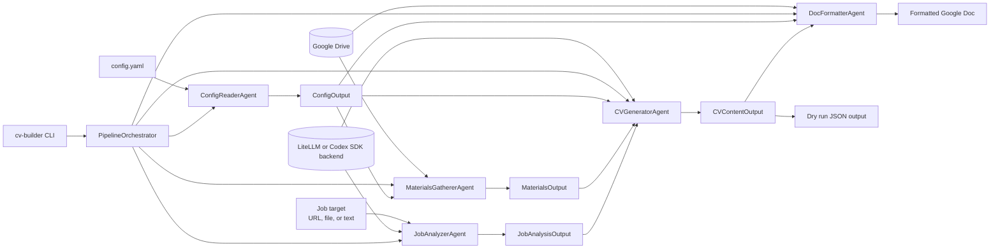

# CV Builder

Multi-agent system for generating personalized CVs from Google Drive materials and job targets.

## Overview

CV Builder uses a pipeline of specialized agents to:

1. Read configuration from `config.yaml`
2. Gather user materials from Google Drive folders
3. Analyze job postings from URLs, files, or free-form descriptions
4. Generate tailored CV content using an LLM backend
5. Create formatted Google Docs

## Installation

```bash
# Create virtual environment
python -m venv .venv
source .venv/bin/activate  # On Windows: .venv\Scripts\activate

# Install Python dependencies
pip install -e ".[dev]"

# Install Codex bridge dependencies if you want the Codex backend
npm install --prefix codex_bridge
```

## Google Drive API Setup

CV Builder requires Google Drive API access to read your materials and create CVs.

### 1. Create Google Cloud Project

1. Go to [Google Cloud Console](https://console.cloud.google.com/)
2. Create a new project or select an existing one
3. Enable:
   - Google Drive API
   - Google Docs API

### 2. Create OAuth Credentials

1. Go to **APIs & Services** > **Credentials**
2. Click **Create Credentials** > **OAuth client ID**
3. Select **Desktop app**
4. Download the credentials JSON file

### 3. Configure Credentials

Option A, environment variable:

```bash
export GOOGLE_DRIVE_OAUTH_CREDENTIALS='{"installed":{"client_id":"...","client_secret":"..."}}'
```

Option B, config file:

```bash
mkdir -p ~/.cv-builder
cp ~/Downloads/credentials.json ~/.cv-builder/
```

### 4. Authenticate

```bash
cv-builder auth
cv-builder auth --status
```

Tokens are stored at `~/.cv-builder/token.json`.

## LLM Backend Configuration

CV Builder supports two runtime-selectable LLM backends:

- `litellm` for the current Bedrock-oriented flow
- `codex-sdk` for the Codex SDK bridge

Backend selection precedence is:

1. `--llm-backend`
2. `CV_BUILDER_LLM_BACKEND`
3. default `litellm`

### LiteLLM / Bedrock

Copy `.env.example` to `.env` and configure:

```bash
AWS_REGION=eu-west-1
AWS_PROFILE=claude
BEDROCK_MODEL_FAST=arn:aws:bedrock:...
BEDROCK_MODEL_BEST=arn:aws:bedrock:...
```

### Codex SDK

Configure these values in `.env`:

```bash
CV_BUILDER_LLM_BACKEND=codex-sdk
CODEX_MODEL_FAST=gpt-5.4-mini
CODEX_MODEL_BEST=gpt-5.4
CODEX_NODE_BIN=node
```

Requirements:

1. Install bridge dependencies with `npm install --prefix codex_bridge`
2. Use Node.js 18 or newer
3. Ensure local Codex authentication is available

## CV Builder Configuration

Edit `config.yaml` with your Google Drive folder IDs:

```yaml
source_folders:
  - your_folder_id_1
  - your_folder_id_2

output_folder: your_output_folder_id

format:
  max_pages: 2
  language: en
  style: modern
  template: chronological
```

## Usage

```bash
# Generate CV from a job URL
cv-builder generate "https://linkedin.com/jobs/view/123456"

# Generate from local job description file
cv-builder generate ./job-description.txt

# Generate from inline description
cv-builder generate "Senior Python Developer at fintech startup"

# Dry run without creating a Google Doc
cv-builder generate "..." --dry-run

# Override style
cv-builder generate "..." --style technical

# Validate configuration and backend prerequisites
cv-builder validate

# Validate or run with the Codex backend explicitly
cv-builder validate --llm-backend codex-sdk
cv-builder generate "..." --llm-backend codex-sdk
```

## Architecture



Pipeline order:

1. `ConfigReaderAgent` reads `config.yaml`, applies defaults, validates values, and normalizes Google Drive folder IDs.
2. `MaterialsGathererAgent` reads documents from the configured Google Drive source folders.
3. `JobAnalyzerAgent` turns the target job description into structured requirements.
4. `CVGeneratorAgent` combines config, source materials, and job analysis to generate structured CV content.
5. `DocFormatterAgent` turns that CV content into a Google Doc unless `--dry-run` is used.

Agent roles:

- `ConfigReaderAgent`: deterministic config parsing and validation, no LLM.
- `MaterialsGathererAgent`: deterministic Google Drive ingestion, no LLM.
- `JobAnalyzerAgent`: LLM-backed extraction of structured job requirements.
- `CVGeneratorAgent`: LLM-backed generation of tailored CV content.
- `DocFormatterAgent`: deterministic Google Docs creation and formatting, no LLM.

See `.specs/` for detailed specifications.

## Development

```bash
# Run tests
.venv\Scripts\python -m pytest -q

# Run a specific test file
.venv\Scripts\python -m pytest tests/test_config_reader.py -v

# Run integration tests
.venv\Scripts\python -m pytest -m integration

# Run Codex bridge integration tests when bridge deps and auth are available
.venv\Scripts\python -m pytest -m codex_integration
```

## License

MIT
